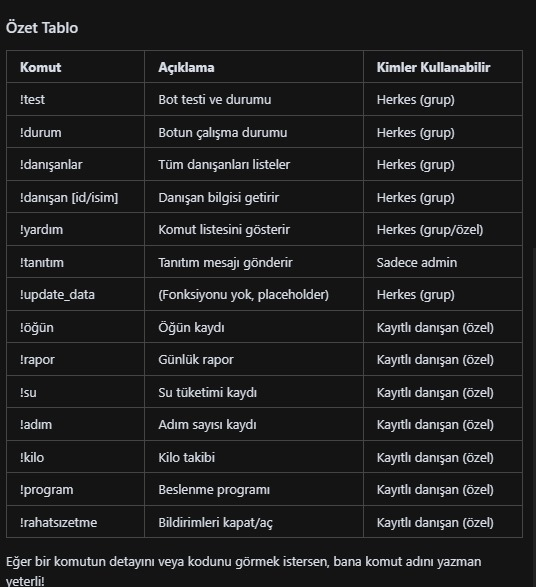
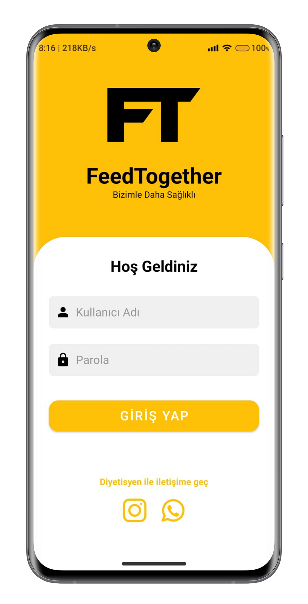
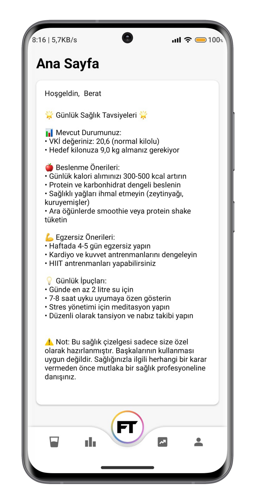
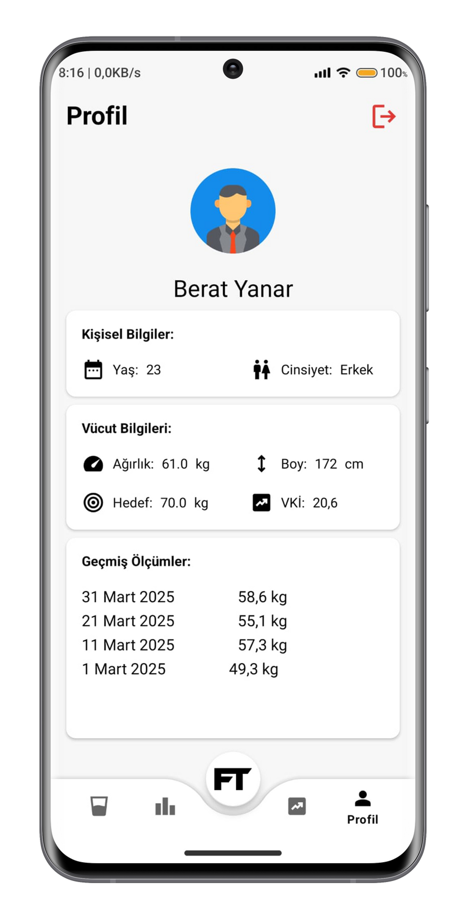
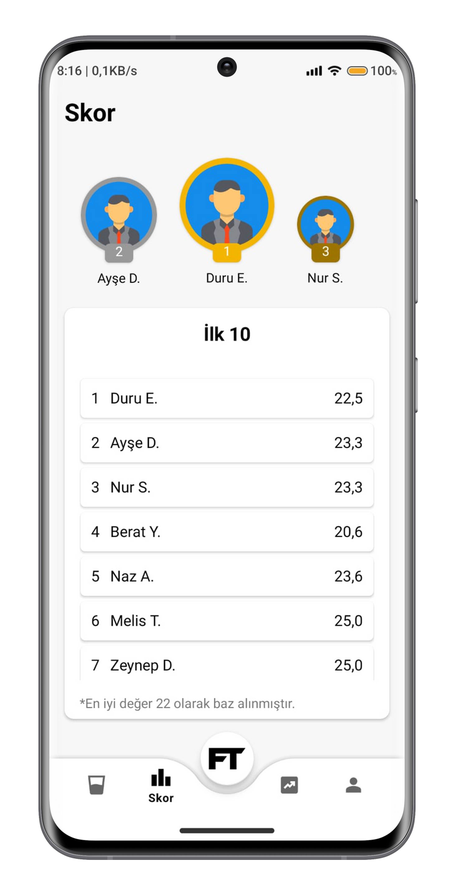
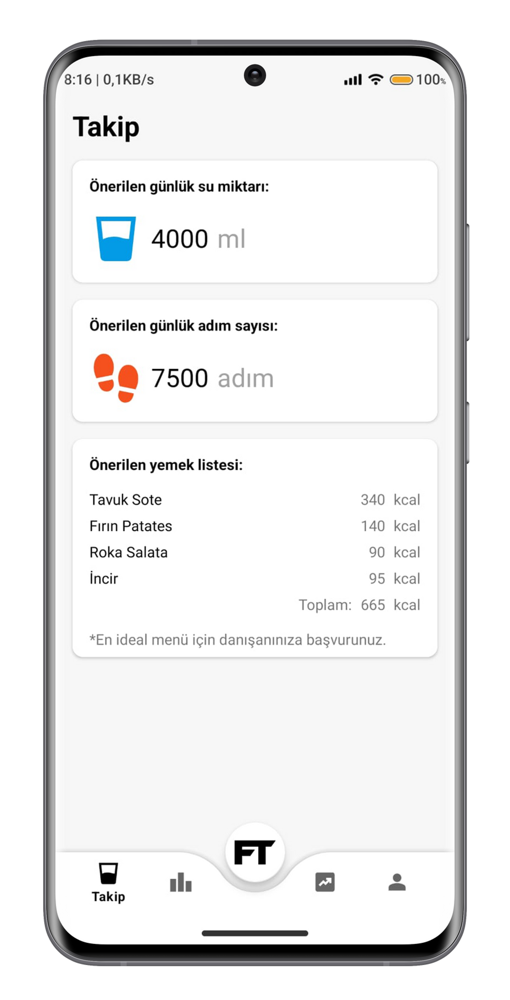
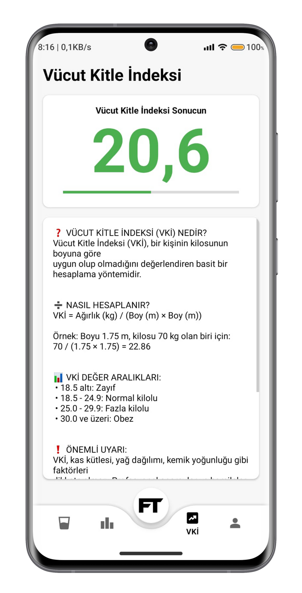

# FeedTogether

FeedTogether is a hybrid platform that brings together a mobile app, server backend, SMS/WhatsApp notifications, and automation infrastructure to enable dietitians to provide online support to their clients.

---

## 📋 Table of Contents

- [About the Project](#-about-the-project)
- [Features](#-features)
- [Architecture](#-architecture)
- [Technologies](#-technologies)
- [Installation & Running](#-installation--running)
- [Dietitian Commands](#-dietitian-commands)
- [Screenshots](#-screenshots)
- [Roadmap](#-roadmap)
- [Contributors](#-contributors)
- [License](#-license)

---

## ℹ️ About the Project

FeedTogether is an integrated system designed to streamline client tracking for nutrition professionals (dietitians).

- **Client App (Kotlin mobile):**  
  - Track daily calorie intake  
  - Calculate Body Mass Index (BMI)  
  - View weekly/monthly meal plans  
  - Request appointments  

- **Backend (Raspberry Pi 5):**  
  - Stores client data in an SQL database  
  - Schedules automated notifications, SMS/WhatsApp messages, and calls  
  - Provides pedometer integration and AI-powered recommendations  

- **Dietitian Panel:**  
  - Query full client list or individual profiles with simple commands  
  - Send weekly meal plans with a single command  

---

## 🚀 Features

- **Real-Time Notifications**  
- **Automation & Scheduling**  
- **Mobile Application**  
- **Pedometer Integration**  
- **AI-Powered Recommendations**  
- **Easy Dietitian Commands**

---

## 🏗️ Architecture


1. **Raspberry Pi 5** – Always-on server (Docker, Node.js, Python, SQL)  
2. **Database** – Client info, notifications, activity data  
3. **API Layer** – RESTful endpoints for mobile & automation  
4. **Mobile App** – Kotlin/Android UI & offline sync  
5. **Automation & Notification Module**  
6. **Dietitian CLI** – Command-line management  

---

## 🛠️ Technologies

| Layer                | Technology                      |
| -------------------- | ------------------------------ |
| Operating System     | Raspberry Pi OS                |
| Containerization     | Docker                         |
| Backend              | Node.js, Python                |
| Database             | PostgreSQL / MySQL             |
| Mobile App           | Kotlin, Android SDK            |
| Notification Services| Twilio, WhatsApp API           |
| AI/ML                | TensorFlow / PyTorch (optional)|

---

## ⚙️ Installation & Running

1. **Clone the repo**
   ```bash
   git clone https://github.com/your_username/FeedTogether.git
   cd FeedTogether
   ```

2. **Configure environment variables**
   ```bash
   cp .env.example .env
   ```
   Edit `.env` with your API keys & DB credentials.

3. **Start services**
   ```bash
   docker-compose up --build -d
   ```

4. **Run the mobile app**
   Open in Android Studio, set `API_URL` and `API_KEY`, then build & run.

---

## 💬 Dietitian Commands

  
*Example screenshot of the dietitian command-line panel.*

---

## 📸 Screenshots

| Login Page | Home Page | Meal Plan |
|:----------:|:---------:|:---------:|
|  |  |  |

| Scoreboard | Daily Summary | BMI Calculator |
|:----------:|:-------------:|:--------------:|
|  |  |  |

---

## 📈 Roadmap

- Secure payment and subscription integration for dietitian-client management
- In-app AI-powered assistant that generates personalized meal and activity plans
- Real-time messaging and video consultation between dietitians and clients
- Advanced analytics and progress dashboards for both clients and dietitians
- Multi-language support and localization for international use
- Enhanced push notifications and flexible reminder scheduling
- Integration with wearables (smartwatches, fitness bands) for automatic activity & health data sync
- Public API for third-party integrations (e.g., fitness apps, clinics)
- Customizable reporting and export features for professionals

---

## 🤝 Contributors

Project Owner: **tolga-sparkles**

Developers:
- [tolga-sparkles](https://github.com/tolga-sparkles)
- [mbydesignn](https://github.com/mbydesignn)

---

## 📄 License

This project is licensed under the MIT License.

---

---

# FeedTogether (Türkçe)

FeedTogether, beslenme danışmanlarının danışanlarına çevrimiçi destek verebilmeleri için geliştirilmiş; mobil uygulama, sunucu, SMS/Whatsapp bildirimleri ve otomasyon altyapısını bir araya getiren hibrit bir platformdur.

---

## 📋 İçindekiler

- [Proje Hakkında](#-proje-hakkında)
- [Özellikler](#-özellikler)
- [Mimari](#-mimari)
- [Teknolojiler](#-teknolojiler)
- [Kurulum--çalıştırma](#-kurulum--çalıştırma)
- [Diyetisyen Komutları](#-diyetisyen-komutları)
- [Ekran Görüntüleri](#-ekran-görüntüleri)
- [Gelecek Planları](#-gelecek-planları)
- [Katkıda Bulunanlar](#-katkıda-bulunanlar)
- [Lisans](#-lisans)

---

## ℹ️ Proje Hakkında

FeedTogether, beslenme alanındaki profesyonellerin (diyetisyenlerin) danışan takibini kolaylaştırmak üzere geliştirilmiş bütünleşik bir sistemdir.

- **Danışan Uygulaması (Kotlin mobil):**  
  - Günlük kalori alımını takip edebilir  
  - Vücut kitle indeksi (BMI) hesaplayabilir  
  - Haftalık/aylık beslenme planlarına erişebilir  
  - Randevu talebi oluşturabilir  

- **Sunucu (Raspberry Pi 5):**  
  - Tüm danışan verilerini SQL veri tabanında saklar  
  - Otomatik bildirim, SMS/WhatsApp ve arama planlaması yapar  
  - Adım sayar entegrasyonu ve yapay zeka destekli öneriler sunar  

- **Diyetisyen Paneli:**  
  - Basit komutlarla tüm danışan listesini veya bireysel profilleri sorgular  
  - Haftalık yemek planlarını tek komutla gönderir  

---

## 🚀 Özellikler

- **Gerçek Zamanlı Bildirimler**  
- **Otomasyon & Planlama**  
- **Mobil Uygulama**  
- **Adım Sayar Entegrasyonu**  
- **Yapay Zeka Destekli Öneriler**  
- **Kolay Diyetisyen Komutları**

---

## 🏗️ Mimari


1. **Raspberry Pi 5** – Sürekli çalışan sunucu (Docker, Node.js, Python, SQL)  
2. **Veri Tabanı** – Danışan bilgileri, bildirimler, aktivite verisi  
3. **API Katmanı** – Mobil ve otomasyon için RESTful uç noktalar  
4. **Mobil Uygulama** – Kotlin/Android arayüzü & offline senkronizasyon  
5. **Otomasyon & Bildirim Modülü**  
6. **Diyetisyen CLI** – Komut satırı yönetimi  

---

## 🛠️ Teknolojiler

| Katman              | Teknoloji                     |
| ------------------- | ---------------------------- |
| Sunucu OS           | Raspberry Pi OS               |
| Konteynerizasyon    | Docker                        |
| Backend             | Node.js, Python               |
| Veri Tabanı         | PostgreSQL / MySQL            |
| Mobil Uygulama      | Kotlin, Android SDK           |
| Bildirim Servisleri | Twilio, WhatsApp API          |
| Yapay Zeka / ML     | TensorFlow / PyTorch (opsiyonel)|

---

## ⚙️ Kurulum--Çalıştırma

1. **Repoyu klonlayın**
   ```bash
   git clone https://github.com/kullanici_adiniz/FeedTogether.git
   cd FeedTogether
   ```

2. **Ortam değişkenlerini ayarlayın**
   ```bash
   cp .env.example .env
   ```
   `.env` dosyasını API anahtarları ve veritabanı bilgilerine göre güncelleyin.

3. **Servisleri başlatın**
   ```bash
   docker-compose up --build -d
   ```

4. **Mobil uygulamayı çalıştırın**
   Android Studio'da açın,  
   API_URL ve API_KEY değerlerini ayarlayın,  
   derleyip çalıştırın.

---

## 💬 Diyetisyen Komutları

  
*Diyetisyen paneli komut ekranı örneği.*

---

## 📸 Ekran Görüntüleri

| Giriş Sayfası | Ana Sayfa | Yemek Planı |
|:-------------:|:---------:|:-----------:|
|  |  |  |

| Skor Tablosu | Günlük Özet | BMI Hesaplama |
|:------------:|:-----------:|:-------------:|
|  |  |  |

---

## 📈 Gelecek Planları

- Diyetisyen ve danışanlar arasında güvenli online ödeme ve abonelik sistemi entegrasyonu
- Kişiye özel yemek ve aktivite planları oluşturabilen yapay zeka modülü
- Gerçek zamanlı sohbet ve video görüşme desteği
- Danışan ve diyetisyen için gelişmiş analiz ve ilerleme ekranları
- Çoklu dil desteği ve yerelleştirme
- Gelişmiş bildirim sistemi ve esnek hatırlatma planlaması
- Akıllı saat, bileklik gibi giyilebilir cihazlarla otomatik sağlık verisi entegrasyonu
- Kamuya açık API ile üçüncü parti uygulamalarla (spor/sağlık uygulamaları, klinikler vb.) entegrasyon
- Profesyoneller için özelleştirilebilir raporlama ve dışa aktarma imkanı

---

## 🤝 Katkıda Bulunanlar

Proje Sahibi: **tolga-sparkles**

Geliştiriciler:
- [tolga-sparkles](https://github.com/tolga-sparkles)
- [mbydesignn](https://github.com/mbydesignn)

---

## 📄 Lisans

Bu proje MIT Lisansı ile lisanslanmıştır.
